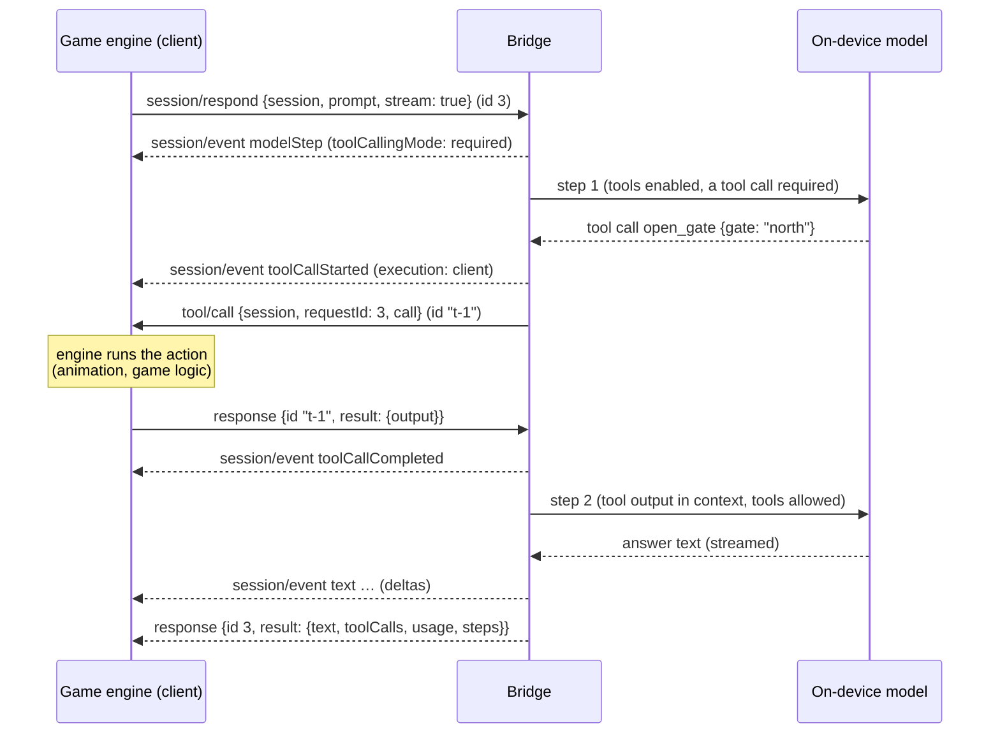

# open-apple-models bridge protocol (v1.0)

The bridge lets game engines and other languages drive on-device Apple Foundation Models **agents**, with
**real tool calls**: the model decides to call a tool, *your engine* executes it (play an animation, open a
door, query game state) and replies, and the model continues with the result.

It is one [JSON-RPC 2.0](https://www.jsonrpc.org/specification) protocol with three transports:

| Transport | How | Used by |
|---|---|---|
| stdio | `oam stdio` reads requests from stdin and writes messages to stdout, one JSON object per line | any language that can spawn a process |
| C ABI | `libOpenAppleModelsFFI` (`bindings/c/open_apple_models.h`): `oam_bridge_send()` in, a callback out | Unity (C#), Godot, Unreal, Python (ctypes), Rust… |
| Swift | `BridgeEngine.receive(_:)` / `send` closure, or `BridgeEngine.call(_:_:)` in-process | the two above, tests, Swift hosts |

Bindings: `bindings/python/open_apple_models.py`, `bindings/unity/OpenAppleModels.cs`, `bindings/c/example.c`
(see `bindings/README.md`).

---

## 1. Framing

* Every message is a single JSON object encoded as UTF-8 on **one line** (no embedded newlines; strings escape them).
  Over stdio, messages are separated by `\n`. Through the C ABI, each call/callback carries exactly one message
  (no trailing newline).
* `"jsonrpc": "2.0"` is required on every message.
* Request ids may be strings or numbers and are echoed back exactly. `null` ids are rejected.
* Batches (JSON arrays) are **not supported**: send one message per line.
* Params are always **by name** (an object). Absent params mean `{}`. `null` members are treated as absent.
* Unknown members in `session/create` and `session/respond` are ignored and reported in `warnings`.
* Blank lines are ignored.

Message kinds:

| Direction | Kind | Example |
|---|---|---|
| client → bridge | request (has `id`) | `{"jsonrpc":"2.0","id":1,"method":"session/respond","params":{…}}` |
| client → bridge | notification (no `id`, no response) | `{"jsonrpc":"2.0","method":"session/cancel","params":{"session":"gorm"}}` |
| bridge → client | response to your request | `{"jsonrpc":"2.0","id":1,"result":{…}}` or `{"jsonrpc":"2.0","id":1,"error":{…}}` |
| bridge → client | notification | `session/event`, `tool/cancel` |
| bridge → client | request (you must respond) | `tool/call` with id `"t-<n>"` |
| client → bridge | response to a bridge request | `{"jsonrpc":"2.0","id":"t-3","result":{"output":"…"}}` |

## 2. Ordering and concurrency guarantees

1. **Requests are handled in arrival order.** Each request is validated, and its order-sensitive part is done
   (a session is created; a turn takes its place in the session's queue), before the next message is looked at.
   So you can **pipeline** — send `session/create` and `session/respond` back to back without waiting.
2. **Long work runs concurrently.** A `session/respond` turn does not block later requests: while it runs, you can
   create other sessions, list, cancel, or run turns on other sessions (different sessions run in parallel).
3. **Per-session order.** Turn-affecting operations on one session — `session/respond`, `session/reset`,
   `session/compact`, `session/setInstructions`, `session/setContextNote`, `session/setTools` — run one after
   another in arrival order. (`session/cancel`, `session/delete`, `session/list` and `session/transcript` act
   immediately.)
4. **Your responses bypass the queue.** A response to `tool/call` is applied the moment it arrives, so a waiting
   turn is never stuck behind other requests.
5. **Output order.** The bridge emits messages one at a time, never concurrently (C ABI: your callback is never
   re-entered), in the order they were produced. For any request, **every `session/event` notification and
   `tool/call` request it causes is sent before its response.** Events for one turn are in the order they
   happened.
6. Every request gets exactly one response (unless the bridge is destroyed through the C ABI first). Cancelled
   turns get an error response with code `-32009` (`cancelled`).
7. On the on-device model, one turn takes ~1–2 s for a plain answer and +2–5 s per tool round. Streaming
   deltas are coalesced (fewer deltas than tokens is normal).

## 3. A complete exchange

```text
→ {"jsonrpc":"2.0","id":1,"method":"initialize","params":{"client":{"name":"MyGame","version":"1.2"},"protocolVersion":"1.0"}}
← {"jsonrpc":"2.0","id":1,"result":{"protocolVersion":"1.0","server":{"name":"open-apple-models","version":"0.1.0"},"capabilities":{…},"model":{"available":true,"contextSize":8192,"variant":"AFM 3 Core Advanced","supportedLanguages":["da","de","en",…]}}}

→ {"jsonrpc":"2.0","id":2,"method":"session/create","params":{"session":"guard","instructions":"You are a castle guard in a game. Use tools to act. Reply in one sentence.","tools":[{"name":"open_gate","description":"Ask the game engine to open a named gate. Returns whether it opened.","parameters":{"type":"object","properties":{"gate":{"type":"string"}},"required":["gate"]}}],"options":{"toolChoice":"required"}}}
→ {"jsonrpc":"2.0","id":3,"method":"session/respond","params":{"session":"guard","prompt":"Please open the north gate.","stream":true}}
← {"jsonrpc":"2.0","id":2,"result":{"session":"guard","warnings":[]}}
← {"jsonrpc":"2.0","method":"session/event","params":{"session":"guard","requestId":3,"event":{"type":"modelStep","step":{"index":0,"completedToolRounds":0,"toolCallingMode":"required","enabledTools":["open_gate"],"trimmedEntries":0}}}}
← {"jsonrpc":"2.0","method":"session/event","params":{"session":"guard","requestId":3,"event":{"type":"toolCallStarted","call":{"id":"call_NYH7…","name":"open_gate","arguments":{"gate":"north"}},"execution":"client"}}}
← {"jsonrpc":"2.0","id":"t-1","method":"tool/call","params":{"session":"guard","requestId":3,"call":{"id":"call_NYH7…","name":"open_gate","arguments":{"gate":"north"}}}}
   … the engine plays the gate animation …
→ {"jsonrpc":"2.0","id":"t-1","result":{"output":{"opened":false,"reason":"the portcullis chain is jammed"}}}
← {"jsonrpc":"2.0","method":"session/event","params":{"session":"guard","requestId":3,"event":{"type":"toolCallCompleted","record":{"call":{…},"output":{"opened":false,"reason":"the portcullis chain is jammed"},"isError":false,"durationSeconds":0.84}}}}
← {"jsonrpc":"2.0","method":"session/event","params":{"session":"guard","requestId":3,"event":{"type":"modelStep","step":{"index":1,"completedToolRounds":1,"toolCallingMode":"allowed","enabledTools":["open_gate"],"trimmedEntries":0}}}}
← {"jsonrpc":"2.0","method":"session/event","params":{"session":"guard","requestId":3,"event":{"type":"text","delta":"The north gate","text":"The north gate","isReset":false}}}
← … more text events …
← {"jsonrpc":"2.0","id":3,"result":{"session":"guard","text":"The north gate remains shut because the portcullis chain is jammed.","toolCalls":[{…}],"usage":{"inputTokens":184,"cachedInputTokens":183,"outputTokens":17,"totalTokens":201},"steps":[{…},{…}]}}
```

(Adapted from real runs against the on-device model; ids shortened.)

## 4. Sequence of a client tool call



If the engine does not answer within the tool's timeout (default 120 s), the model receives an error output
("Tool 'open_gate' timed out…"), the bridge sends `tool/cancel` for that call, and a late response is ignored.
The same happens when the turn is cancelled while a call is outstanding.

## 5. Methods (client → bridge)

### `initialize`

Optional handshake; recommended as the first message.

| Param | Type | |
|---|---|---|
| `client` | object | free-form, e.g. `{"name": "MyGame", "version": "1.2"}` |
| `protocolVersion` | string | `"1.0"`; a different major version is rejected with `-32602` |

Result:

```json
{
  "protocolVersion": "1.0",
  "server": {"name": "open-apple-models", "version": "0.1.0"},
  "capabilities": {
    "methods": ["initialize", "model/availability", "ping", "schema/validate", "session/cancel", "…"],
    "notifications": ["session/event", "tool/cancel"],
    "clientRequests": ["tool/call"],
    "streaming": true, "clientTools": true, "structuredOutput": true,
    "models": ["system", "scripted"], "maxSessions": 64, "batch": false
  },
  "model": { "…same as model/availability…": true }
}
```

`capabilities.methods` includes methods added by extensions (e.g. NPC/decision/world methods).

### `ping`

Result `{}`. Health check.

### `model/availability`

```json
{"available": true, "contextSize": 8192, "variant": "AFM 3 Core Advanced",
 "supportedLanguages": ["da", "de", "en", "en-AU", "…"]}
```

When unavailable: `{"available": false, "reason": "device_not_eligible" | "apple_intelligence_not_enabled" |
"model_not_ready" | "unknown", …}`. Sessions on the system model can still be created; their turns fail with
`-32001 model_unavailable` until the model is ready. Scripted sessions always work.

### `session/create`

Creates an agent with its own conversation.

| Param | Type | Default | |
|---|---|---|---|
| `session` | string | generated (`s1`, `s2`, …) | 1–128 printable characters; must be unused |
| `instructions` | string | none | system instructions (persona, rules) |
| `tools` | array | `[]` | [tool definitions](#tool-definitions); Apple recommends ≤ 3–5 tools per request on-device |
| `options` | object | | see below |
| `history` | object | | a transcript from `session/transcript` (either the `transcript` value or the whole result) |
| `model` | string/object | `"system"` | `"system"`, `{"type": "scripted", …}` ([scripted model](#scripted-model)), or a custom type the host registered |

`options`:

| Option | Type | Default | |
|---|---|---|---|
| `toolChoice` | `"auto"`/`"none"`/`"required"`/`{"tool": name}` | `"auto"` | default for each turn. `required` / `{"tool"}` force a tool call on the **first model step only**, then the model answers freely |
| `maxToolRounds` | int ≥ 0 | 4 | model steps that may call tools; afterwards tools are disabled so the model must answer |
| `maxToolCalls` | int ≥ 0 | 12 | tool calls per turn; extra calls get an error output |
| `enabledTools` | [string] | all | restrict the tools visible to the model |
| `temperature` | number ≥ 0 | model default | |
| `maxResponseTokens` | int ≥ 1 | none | |
| `sampling` | `"greedy"` / `{"topK": n, "seed"?}` / `{"topP": p, "seed"?}` | model default | `"greedy"` makes NPC decisions reproducible |
| `toolTimeoutSeconds` | number ≥ 0 | 120 | time the engine has to answer a `tool/call`; `0` = wait forever |
| `trimHistory` | bool | `true` | hide the oldest turns from the model when the 8192-token context would overflow (the transcript keeps them) |
| `reservedResponseTokens` | int ≥ 0 | 1024 | tokens kept free for the answer when trimming |
| `maxAttempts` | int ≥ 1 | 2 | automatic retries of transient model failures (never after a tool ran) |

Result: `{"session": "guard", "warnings": ["open_gate: #/properties/code: pattern '…' is described to the model but not enforced", …]}`.
Warnings cover unenforceable schema constraints, unknown parameters, missing tool descriptions and an unavailable model.

### `session/respond`

Runs one turn.

| Param | Type | |
|---|---|---|
| `session` | string | required |
| `prompt` | string | required. `""` is allowed (continues the conversation, e.g. after a restored tool output) |
| `schema` | object | JSON Schema for [structured output](#json-schema-support); tools may be called first, then the answer is generated as schema-valid JSON |
| `stream` | bool | `false`. When true, `session/event` notifications are sent while the turn runs |
| `toolChoice`, `maxToolRounds`, `maxToolCalls`, `enabledTools` | | per-turn overrides of the session options |

Result:

```json
{
  "session": "guard",
  "text": "The north gate remains shut because the portcullis chain is jammed.",
  "structured": {"reasoning": "…", "choice": "refuse"},
  "toolCalls": [
    {"call": {"id": "call_…", "name": "open_gate", "arguments": {"gate": "north"}},
     "output": {"opened": false, "reason": "the portcullis chain is jammed"},
     "isError": false, "durationSeconds": 0.84}
  ],
  "usage": {"inputTokens": 184, "cachedInputTokens": 183, "outputTokens": 17, "totalTokens": 201},
  "steps": [
    {"index": 0, "completedToolRounds": 0, "toolCallingMode": "required", "enabledTools": ["open_gate"], "trimmedEntries": 0},
    {"index": 1, "completedToolRounds": 1, "toolCallingMode": "allowed", "enabledTools": ["open_gate"], "trimmedEntries": 0}
  ],
  "warnings": ["…only present when there are warnings…"]
}
```

* `structured` is present only for schema turns; `text` is then the JSON text of `structured`. Keys follow the
  schema's property order (put `reasoning` before `choice` for a small chain of thought).
* `toolCalls` are in completion order. `output` is a string for text outputs and error messages, or the JSON value
  the engine returned. `isError` marks errors the model saw (it may recover from them).
* A failed or cancelled turn leaves no trace in the history.

### `session/cancel`

`{"session"}` → `{"session", "cancelled": n}`. Cancels the running turn and every queued operation of the session.
Each cancelled request gets error `-32009`. Outstanding `tool/call`s get `tool/cancel`. Also useful as a
notification.

### `session/reset`

`{"session"}` → `{"session"}`. Clears the conversation and context note (keeps instructions and tools). Queued
behind earlier turns of the session; send `session/cancel` first to abort them.

### `session/delete`

`{"session"}` → `{"session", "deleted": true}`. Cancels its work and frees it.

### `session/list`

→ `{"sessions": [{"session", "model", "instructions"?, "tools": [names], "busy", "pendingOperations", "entries", "createdAt"}]}`
in creation order. `entries` counts transcript entries after the instructions (prompts, responses, tool calls, tool outputs).

### `session/transcript`

`{"session"}` → `{"session", "transcript": {"type": "FoundationModels.Transcript", "version": "1.1", "transcript": {"entries": […]}}}`.

The transcript is FoundationModels' own `Codable` form. Save it (e.g. with the game save) and pass it as `history`
to `session/create` to resume. Reading during a running turn returns the in-progress state.

### `session/setInstructions`

`{"session", "instructions": string | null}` → `{"session"}`. Applies from the next turn.

### `session/setContextNote`

`{"session", "note": string | null}` → `{"session"}`. Extra context appended to the instructions (world facts,
quest state, a summary). Applies from the next turn.

### `session/setTools`

`{"session", "tools": [definitions]}` → `{"session", "warnings"}`. Replaces the tool set from the next turn.

### `session/compact`

`{"session", "keepRecentTurns"?: 2, "summaryInstructions"?: string}` → `{"session", "summary": string | null}`.
Summarizes all but the most recent turns into the context note (one extra model call) and drops them, so long
conversations fit the 8192-token window while keeping their gist. `summary` is `null` when there was nothing to compact.

### `schema/validate`

`{"schema", "name"?: "Response"}` → `{"warnings", "generationSchema"}`. Converts JSON Schema to the model's
generation schema without running the model. Invalid schemas fail with `-32007` and `data.path`/`data.schemaPath`.

### `tools/validate`

`{"tools"}` → `{"tools": [{"name", "warnings", "generationSchema"}], "warnings"}`.

### `shutdown`

→ `{}`. Cancels every turn and pending `tool/call`, deletes all sessions, and shuts down extensions; cancelled
requests receive their error responses first (bounded wait). Afterwards every request fails with `-32023 shut_down`.
Hosts get a callback after the response has been delivered (`BridgeConfiguration.onShutdown`), which a
stdio server uses to exit.

## 6. Messages from the bridge

### `session/event` (notification)

Sent only for turns started with `"stream": true`.

```json
{"jsonrpc": "2.0", "method": "session/event",
 "params": {"session": "guard", "requestId": 3, "event": {"type": "text", "delta": " gate", "text": "The north gate", "isReset": false}}}
```

`requestId` is the id of the `session/respond` request. Event types:

| `type` | Fields | Meaning |
|---|---|---|
| `modelStep` | `step` (same shape as `result.steps[]`) | the model is about to run an inference step |
| `text` | `delta`, `text`, `isReset` | new text; `text` is the whole answer so far. If the model rewrote earlier text, `isReset` is true and `delta` is the whole new text |
| `partial` | `value` | partially generated structured output (schema turns) |
| `toolCallStarted` | `call`, `execution` (`"client"` or `"local"`) | a tool call began. For client tools, execute it when the `tool/call` **request** arrives, not on this event |
| `toolCallCompleted` | `record` (same shape as `result.toolCalls[]`) | a tool finished |

### `tool/call` (request — you must respond)

```json
{"jsonrpc": "2.0", "id": "t-1", "method": "tool/call",
 "params": {"session": "guard", "requestId": 3, "call": {"id": "call_…", "name": "open_gate", "arguments": {"gate": "north"}}}}
```

`arguments` follow the tool's `parameters` schema (the model is constrained to it). Several calls of one model step
arrive back to back and may be answered in any order. Reply with the same `id`:

| Reply | The model sees |
|---|---|
| `{"result": {"output": "The gate opened."}}` | the text |
| `{"result": {"output": {"opened": true}}}` | compact JSON `{"opened":true}` |
| `{"result": {"output": "Chain jammed.", "isError": true}}` | `Error: Chain jammed.` (it may retry or explain) |
| `{"error": {"code": -32000, "message": "Gate subsystem offline"}}` | `Error: Gate subsystem offline` |
| `{"result": {"opened": true}}` (no `output`) | lenient: the whole result is the output |

Tool errors never fail the turn; the model decides what to do. Extensions put their own context fields in the
params instead of `session` (e.g. `"npc": "gorm"`).

### `tool/cancel` (notification)

```json
{"jsonrpc": "2.0", "method": "tool/cancel",
 "params": {"session": "guard", "requestId": 3, "id": "t-1", "callId": "call_…", "reason": "Error: Tool 'open_gate' timed out after 120s."}}
```

The bridge no longer needs the output of `tool/call` `id` (timeout, cancelled or finished turn). Stop the action
if you can; any response you still send is ignored.

## 7. Errors

Error responses follow JSON-RPC: `{"code": int, "message": string, "data": {"code": string, …}}`.
`data.code` is a stable string — prefer it over the number.

| Code | `data.code` | When |
|---|---|---|
| -32700 | `parse_error` | the line is not valid JSON (`id` is `null`) |
| -32600 | `invalid_message` | not a JSON-RPC 2.0 message, bad `id`, batch |
| -32601 | `method_not_found` | unknown method (`data.method`) |
| -32602 | `invalid_params` | missing/mistyped parameter; the message names it (e.g. `'options.toolChoice'`) |
| -32603 | `internal_error` | a bug; please report |
| -32001 | `model_unavailable` | device not eligible, Apple Intelligence off, model downloading |
| -32002 | `guardrail_violation` | input or output tripped the safety guardrails (this also happens with violent *game* content — rephrase, or show a fallback line) |
| -32003 | `refusal` | the model refused |
| -32004 | `context_size_exceeded` | conversation too long (enable `trimHistory`, or `session/compact`) |
| -32005 | `rate_limited` | system rate limit (typically when the app is in the background); `data.retryAfter` (ISO 8601) and `data.retryAfterSeconds` when known |
| -32006 | `unsupported_language` | prompt language not supported |
| -32007 | `invalid_schema` | schema/tool definition cannot be used; `data.path`, `data.schemaPath` |
| -32008 | `tool_failed` | a local tool aborted the turn (client tools never do) |
| -32009 | `cancelled` | the turn was cancelled |
| -32010 | `busy` | the model session was busy (should not happen: turns are queued) |
| -32011 | `invalid_request` | the agent rejected the input (e.g. unsupported transcript content) |
| -32012 | `generation_failed` | any other model failure |
| -32020 | `session_not_found` | `data.session` |
| -32021 | `session_exists` | `session/create` with an id in use |
| -32022 | `session_limit` | too many sessions (`data.limit`, default 64) |
| -32023 | `shut_down` | after `shutdown` / destroy |
| -32024 | `timeout` | `oam_call_blocking` timed out (the request was cancelled) |

Extensions use codes in -32050…-32099 for their own errors.

## 8. Tool definitions

```json
{"name": "open_gate",
 "description": "Ask the game engine to open a named gate. Returns whether it opened.",
 "parameters": {"type": "object", "properties": {"gate": {"type": "string", "description": "Gate name"}}, "required": ["gate"]},
 "execution": "client",
 "timeoutSeconds": 30}
```

* `name`: 1–64 of `A–Z a–z 0–9 _ - .`, unique per session.
* `description`: what the tool does and returns — the model decides from it. Warned when missing.
* `parameters`: JSON Schema of the arguments (default: no arguments).
* `execution`: `"client"` (the only kind over the bridge): the engine executes it via `tool/call`.
* `timeoutSeconds`: overrides `options.toolTimeoutSeconds` for this tool (`0` = none).
* OpenAI's `{"type": "function", "function": {…}}` wrapper is accepted.

The on-device model often skips tools in `auto` mode and invents facts. For grounded game state, set
`toolChoice` to `"required"` or `{"tool": "…"}`: the bridge forces the call on the first step only and lets the
model answer afterwards (Apple's own `.required` mode loops forever; the bridge steers each step instead).

### JSON Schema support

Supported: `object` (properties in document order; `required`), `string` with `enum`/`const`, `integer`/`number`
with `minimum`/`maximum`, `boolean`, `array` with `items`/`minItems`/`maxItems`, `anyOf`/`oneOf`, nullable types,
`allOf` of objects, local `$ref` into `$defs`/`definitions`. Constraints the model cannot enforce (`pattern`,
`format`, `minLength`, `multipleOf`, …) are added to the description the model sees and reported as warnings.
Enum-constrained decisions are fast (~1.2 s) and reliable.

## 9. Scripted model

`"model": {"type": "scripted", "steps": [...], "fallback"?: step}` replaces the on-device model with a
deterministic script — for engine development and CI without Apple Intelligence. Everything else (streaming, tool
calls, schemas, errors, cancellation, transcripts) behaves exactly as with the real model. Each model inference plays
the next step; a tool round takes one step and the answer another.

| Step | Effect |
|---|---|
| `{"text": "Hmph.", "chunks"?: 3}` | answer, streamed in about `chunks` pieces |
| `{"toolCalls": [{"name": "open_gate", "arguments": {"gate": "north"}, "id"?: "…"}]}` | one tool round (several calls run in parallel) |
| `{"json": {"choice": "refuse"}}` | structured answer for schema turns |
| `{"template": "Gate says: {toolOutput}"}` | answer with `{prompt}`, `{toolOutput}` (latest tool output of this turn), `{toolOutputs}` (all, one per line) substituted |
| `{"error": "guardrail_violation", "message"?: "…"}` | fail with any `data.code` from the table above that maps to an agent error |
| any step + `"delayMs": 500` | wait first (test cancellation and concurrency) |

When the steps run out, `fallback` (default `{"text": "(script exhausted)"}`) is used. `"model": "scripted"` is an
empty script. Hosts can disable scripted models (`BridgeConfiguration.allowsScriptedModels`).

## 10. Extending the protocol (adding methods)

The engine is a method registry; game-specific methods (`npc/*`, `decision/*`, `world/*`) plug in as a
`BridgeExtension` (Swift):

```swift
import OpenAppleModels
import OpenAppleModelsBridge
import Synchronization

final class NPCMethods: BridgeExtension {
    private let npcs = Mutex<[String: Agent]>([:])

    func register(in registry: inout BridgeMethodRegistry, engine: BridgeEngine) {
        // Fast methods return .result — they run in arrival order.
        registry.register("npc/create") { [self] request in
            let id = try request.params.string("npc")
            let tools = try request.params["tools"].map { value throws(BridgeError) in
                try BridgeCoding.tools(from: value, defaultTimeout: .seconds(60)).tools
            } ?? []
            let model = try request.engine.makeModel(BridgeCoding.modelSpec(request.params["model"]))
            let agent = try Agent(model: model, instructions: try request.params.optionalString("persona"), tools: tools)
            npcs.withLock { $0[id] = agent }
            return .result(["npc": .string(id)])
        }
        // Slow methods do their order-sensitive part now and return .deferred.
        registry.register("npc/say") { [self] request in
            let id = try request.params.string("npc")
            guard let agent = npcs.withLock({ $0[id] }) else {
                throw BridgeError(code: -32050, name: "npc_not_found", message: "No NPC '\(id)'.")
            }
            let run = agent.run(try request.params.string("text"), policy: ToolPolicy(choice: .required))
            let stream = try request.params.optionalBool("stream") ?? false
            return .deferred {
                // Streams "npc/event" notifications and routes client tools through tool/call.
                let response = try await request.drive(run, stream: stream, context: ["npc": .string(id)], eventMethod: "npc/event")
                var result: JSONObject = ["npc": .string(id)]
                for (key, value) in BridgeCoding.json(response) { result[key] = value }
                return .object(result)
            }
        }
    }

    func shutdown() async { npcs.withLock { $0.removeAll() } }
}

let engine = BridgeEngine(configuration: BridgeConfiguration(extensions: [NPCMethods()])) { line in print(line) }
```

Rules of thumb:

* **Handlers run one at a time, in arrival order.** Validate and do order-sensitive work in the handler; return
  `.deferred { … }` for anything that awaits the model or other turns. Awaiting a turn inside a handler blocks
  every later request.
* Use `BridgeSession.schedule { … }` (or your own queue) for per-object ordering; start `Agent.run` in the handler
  so turn order equals arrival order.
* Throw `BridgeError` for protocol errors (`.invalidParams`, custom codes in -32050…-32099 with a `data.code`
  string); any other error (e.g. `AgentError`) is mapped automatically.
* Reuse `BridgeParams` accessors (typed, with messages naming the parameter), `BridgeCoding` (tool definitions,
  tool choice/policy, schemas, transcripts, and the `json(_:)` encoders for responses, records, steps and events)
  and `BridgeRequest.drive(_:stream:context:eventMethod:)` so every method speaks the same dialect.
* Don't keep a strong reference to the engine in the extension (the engine owns its extensions);
  use `request.engine`.
* Extensions are registered after the built-ins and may override them; `engine.register(_:_:)` adds methods at runtime.
* Document new methods in this file and add them to the tests with the scripted model.
