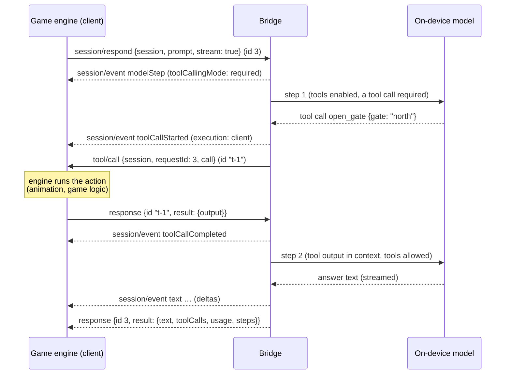

# open-apple-models bridge protocol (v1.0)

The bridge lets game engines and other languages drive on-device Apple Foundation Models **agents**, with
**real tool calls**: the model decides to call a tool, *your engine* executes it (play an animation, open a
door, query game state) and replies, and the model continues with the result. On top of raw agent sessions it
serves [game methods](#6-game-methods-npc-decision-world-contentgenerate): NPCs with personas, memory and save
states, enum-constrained decisions, a shared world-state blackboard, and schema-shaped content generation.

It is one [JSON-RPC 2.0](https://www.jsonrpc.org/specification) protocol with three transports:

| Transport | How | Used by |
|---|---|---|
| stdio | `oam stdio` reads requests from stdin and writes messages to stdout, one JSON object per line | any language that can spawn a process |
| C ABI | `libOpenAppleModelsFFI` (`bindings/c/open_apple_models.h`): `oam_bridge_send()` in, a callback out | Unity (C#), Godot, Unreal, Python (ctypes), Rust… |
| Swift | `BridgeEngine.receive(_:)` / `send` closure, or `BridgeEngine.call(_:_:id:)` in-process | the two above, tests, Swift hosts |

Bindings: `bindings/python/open_apple_models.py`, `bindings/unity/OpenAppleModels.cs`, `bindings/c/example.c`
(see `bindings/README.md`).

---

## 1. Framing

* Every message is a single JSON object encoded as UTF-8 on **one line** (no embedded newlines; strings escape them).
  Over stdio, messages are separated by `\n`. Through the C ABI, each call/callback carries exactly one message
  (no trailing newline).
* `"jsonrpc": "2.0"` is required on every message.
* Request ids may be strings or numbers and are echoed back exactly (integers always as plain digits, also in
  `requestId`). Numbers travel as doubles, so a numeric id must be at most 2^53-1 (9007199254740991) in magnitude;
  larger or non-finite numbers are rejected with `-32600` (`id` `null`) rather than echoed back altered — use string
  ids for 64-bit values. `null` ids are rejected.
* Batches (JSON arrays) are **not supported**: send one message per line.
* Params are always **by name** (an object). Absent params mean `{}`. `null` members are treated as absent.
* Unknown members in `session/create`, `session/respond`, `npc/create`, `npc/restore`, `npc/talk`, `npc/update`,
  `decision/*` and `content/generate` (and unknown `persona`/`options` fields) are ignored and reported in `warnings`.
* Blank lines are ignored.

Message kinds:

| Direction | Kind | Example |
|---|---|---|
| client → bridge | request (has `id`) | `{"jsonrpc":"2.0","id":1,"method":"session/respond","params":{…}}` |
| client → bridge | notification (no `id`, no response) | `{"jsonrpc":"2.0","method":"session/cancel","params":{"session":"gorm"}}` |
| bridge → client | response to your request | `{"jsonrpc":"2.0","id":1,"result":{…}}` or `{"jsonrpc":"2.0","id":1,"error":{…}}` |
| bridge → client | notification | `session/event`, `npc/event`, `world/changed`, `tool/cancel` |
| bridge → client | request (you must respond) | `tool/call` with id `"t-<n>"` |
| client → bridge | response to a bridge request | `{"jsonrpc":"2.0","id":"t-3","result":{"output":"…"}}` |

## 2. Ordering and concurrency guarantees

1. **Requests are handled in arrival order.** Each request is validated, and its order-sensitive part is done
   (a session is created; a turn takes its place in the session's queue), before the next message is looked at.
   So you can **pipeline** — send `session/create` and `session/respond` back to back without waiting.
2. **Long work runs concurrently.** A `session/respond` turn does not block later requests: while it runs, you can
   create other sessions, list, cancel, or run turns on other sessions (different sessions run in parallel).
3. **Per-session order.** Turn-affecting operations on one session — `session/respond`, `session/reset`,
   `session/compact`, `session/setInstructions`, `session/setContextNote`, `session/setTools` — run one after
   another in arrival order. (`session/cancel`, `session/delete`, `session/list` and `session/transcript` act
   immediately.) NPCs work the same way: `npc/talk`, `npc/update`, `npc/reset` and `npc/state` are ordered per NPC.
4. **Your responses bypass the queue.** A response to `tool/call` is applied the moment it arrives, so a waiting
   turn is never stuck behind other requests.
5. **Output order.** The bridge emits messages one at a time, never concurrently (C ABI: your callback is never
   re-entered), in the order they were produced. For any request, **every `session/event`/`npc/event`/`world/changed`
   notification and `tool/call` request it causes is sent before its response.** Events for one turn are in the order they
   happened.
6. Every request gets exactly one response (unless the bridge is destroyed through the C ABI first). Cancelled
   turns get an error response with code `-32009` (`cancelled`).
7. On the on-device model, one turn takes ~1–2 s for a plain answer and +2–5 s per tool round. Streaming
   deltas are coalesced (fewer deltas than tokens is normal).

## 3. A complete exchange

```text
→ {"jsonrpc":"2.0","id":1,"method":"initialize","params":{"client":{"name":"MyGame","version":"1.2"},"protocolVersion":"1.0"}}
← {"jsonrpc":"2.0","id":1,"result":{"protocolVersion":"1.0","server":{"name":"open-apple-models","version":"0.1.0"},"capabilities":{…},"model":{"available":true,"contextSize":8192,"variant":"AFM 3 Core Advanced","supportedLanguages":["da","de","en",…]}}}

→ {"jsonrpc":"2.0","id":2,"method":"session/create","params":{"session":"guard","instructions":"You are a castle guard in a game. Use tools to act. Reply in one sentence.","tools":[{"name":"open_gate","description":"Ask the game engine to open a named gate. Returns whether it opened.","parameters":{"type":"object","properties":{"gate":{"type":"string"}},"required":["gate"]}}],"options":{"toolChoice":"required"}}}
→ {"jsonrpc":"2.0","id":3,"method":"session/respond","params":{"session":"guard","prompt":"Please open the north gate.","stream":true}}
← {"jsonrpc":"2.0","id":2,"result":{"session":"guard","warnings":[]}}
← {"jsonrpc":"2.0","method":"session/event","params":{"session":"guard","requestId":3,"event":{"type":"modelStep","step":{"index":0,"completedToolRounds":0,"toolCallingMode":"required","enabledTools":["open_gate"],"trimmedEntries":0}}}}
← {"jsonrpc":"2.0","method":"session/event","params":{"session":"guard","requestId":3,"event":{"type":"toolCallStarted","call":{"id":"call_NYH7…","name":"open_gate","arguments":{"gate":"north"}},"execution":"client"}}}
← {"jsonrpc":"2.0","id":"t-1","method":"tool/call","params":{"session":"guard","requestId":3,"call":{"id":"call_NYH7…","name":"open_gate","arguments":{"gate":"north"}}}}
   … the engine plays the gate animation …
→ {"jsonrpc":"2.0","id":"t-1","result":{"output":{"opened":false,"reason":"the portcullis chain is jammed"}}}
← {"jsonrpc":"2.0","method":"session/event","params":{"session":"guard","requestId":3,"event":{"type":"toolCallCompleted","record":{"call":{…},"output":{"opened":false,"reason":"the portcullis chain is jammed"},"isError":false,"durationSeconds":0.84}}}}
← {"jsonrpc":"2.0","method":"session/event","params":{"session":"guard","requestId":3,"event":{"type":"modelStep","step":{"index":1,"completedToolRounds":1,"toolCallingMode":"allowed","enabledTools":["open_gate"],"trimmedEntries":0}}}}
← {"jsonrpc":"2.0","method":"session/event","params":{"session":"guard","requestId":3,"event":{"type":"text","delta":"The north gate","text":"The north gate","isReset":false}}}
← … more text events …
← {"jsonrpc":"2.0","id":3,"result":{"session":"guard","text":"The north gate remains shut because the portcullis chain is jammed.","toolCalls":[{…}],"usage":{"inputTokens":184,"cachedInputTokens":183,"outputTokens":17,"totalTokens":201},"steps":[{…},{…}]}}
```

(Adapted from real runs against the on-device model; ids shortened.)

## 4. Sequence of a client tool call



If the engine does not answer within the tool's timeout (default 120 s), the model receives an error output
("Tool 'open_gate' timed out…"), the bridge sends `tool/cancel` for that call, and a late response is ignored.
The same happens when the turn is cancelled while a call is outstanding.

## 5. Methods (client → bridge)

### `initialize`

Optional handshake; recommended as the first message.

| Param | Type | |
|---|---|---|
| `client` | object | free-form, e.g. `{"name": "MyGame", "version": "1.2"}` |
| `protocolVersion` | string | `"1.0"`; a different major version is rejected with `-32602` |

Result:

```json
{
  "protocolVersion": "1.0",
  "server": {"name": "open-apple-models", "version": "0.1.0"},
  "capabilities": {
    "methods": ["initialize", "model/availability", "ping", "schema/validate", "session/cancel", "…"],
    "notifications": ["session/event", "tool/cancel", "npc/event", "world/changed"],
    "clientRequests": ["tool/call"],
    "streaming": true, "clientTools": true, "structuredOutput": true,
    "models": ["system", "scripted"], "maxSessions": 64, "batch": false
  },
  "model": { "…same as model/availability…": true }
}
```

`capabilities.methods` includes methods added by extensions, such as the [game methods](#6-game-methods-npc-decision-world-contentgenerate).

### `ping`

Result `{}`. Health check.

### `model/availability`

```json
{"available": true, "contextSize": 8192, "variant": "AFM 3 Core Advanced",
 "supportedLanguages": ["da", "de", "en", "en-AU", "…"]}
```

When unavailable: `{"available": false, "reason": "device_not_eligible" | "apple_intelligence_not_enabled" |
"model_not_ready" | "unknown", …}`. Sessions on the system model can still be created; their turns fail with
`-32001 model_unavailable` until the model is ready. Scripted sessions always work.

### `session/create`

Creates an agent with its own conversation.

| Param | Type | Default | |
|---|---|---|---|
| `session` | string | generated (`s1`, `s2`, …) | 1–128 printable characters; must be unused |
| `instructions` | string | none | system instructions (persona, rules) |
| `tools` | array | `[]` | [tool definitions](#9-tool-definitions); Apple recommends ≤ 3–5 tools per request on-device |
| `options` | object | | see below |
| `history` | object | | a transcript from `session/transcript` (either the `transcript` value or the whole result). When `instructions` or `tools` are **absent**, the ones saved in the transcript are used, so `{"history": …}` alone resumes a conversation; a present key (even `null` or `[]`) wins |
| `model` | string/object | `"system"` | `"system"`, `{"type": "scripted", …}` ([scripted model](#10-scripted-model)), or a custom type the host registered |

`options`:

| Option | Type | Default | |
|---|---|---|---|
| `toolChoice` | `"auto"`/`"none"`/`"required"`/`"explicit"`/`{"tool": name}` | `"auto"` | default for each turn. `required` / `{"tool"}` force a tool call on the **first model step only**, then the model answers freely; `explicit` makes the first step call a tool or a built-in `respond_directly` tool |
| `maxToolRounds` | int ≥ 0 | 4 | model steps that may call tools; afterwards tools are disabled so the model must answer |
| `maxToolCalls` | int ≥ 0 | 12 | tool calls per turn; extra calls get an error output |
| `enabledTools` | [string] | all | restrict the tools visible to the model |
| `temperature` | number ≥ 0 | model default | |
| `maxResponseTokens` | int ≥ 1 | none | |
| `sampling` | `"greedy"` / `{"topK": n, "seed"?}` / `{"topP": p, "seed"?}` | model default | `"greedy"` makes NPC decisions reproducible |
| `toolTimeoutSeconds` | number 0…86400 | 120 | time the engine has to answer a `tool/call`; `0` = wait forever. Larger, negative or non-finite values fail with `-32602` |
| `trimHistory` | bool | `true` | hide the oldest turns from the model when the 8192-token context would overflow (the transcript keeps them) |
| `reservedResponseTokens` | int ≥ 0 | 1024 | tokens kept free for the answer when trimming |
| `maxAttempts` | int ≥ 1 | 2 | automatic retries of transient model failures (never after a tool ran) |

Result: `{"session": "guard", "warnings": ["open_gate: #/properties/code: pattern '…' is described to the model but not enforced", …]}`.
Warnings cover unenforceable schema constraints, unknown parameters, missing tool descriptions, more than 5 tools
(Apple recommends 3–5 per request on-device) and an unavailable model.

### `session/respond`

Runs one turn.

| Param | Type | |
|---|---|---|
| `session` | string | required |
| `prompt` | string | required. `""` is allowed (continues the conversation, e.g. after a restored tool output) |
| `schema` | object | JSON Schema for [structured output](#json-schema-support); tools may be called first, then the answer is generated as schema-valid JSON |
| `stream` | bool | `false`. When true, `session/event` notifications are sent while the turn runs |
| `toolChoice`, `maxToolRounds`, `maxToolCalls`, `enabledTools` | | per-turn overrides of the session options. A `{"tool": name}` the session lacks fails with `-32602`; it is checked when the turn starts, so an earlier pipelined `session/setTools` counts |

Result:

```json
{
  "session": "guard",
  "text": "The north gate remains shut because the portcullis chain is jammed.",
  "structured": {"reasoning": "…", "choice": "refuse"},
  "toolCalls": [
    {"call": {"id": "call_…", "name": "open_gate", "arguments": {"gate": "north"}},
     "output": {"opened": false, "reason": "the portcullis chain is jammed"},
     "isError": false, "durationSeconds": 0.84}
  ],
  "usage": {"inputTokens": 184, "cachedInputTokens": 183, "outputTokens": 17, "totalTokens": 201},
  "steps": [
    {"index": 0, "completedToolRounds": 0, "toolCallingMode": "required", "enabledTools": ["open_gate"], "trimmedEntries": 0},
    {"index": 1, "completedToolRounds": 1, "toolCallingMode": "allowed", "enabledTools": ["open_gate"], "trimmedEntries": 0}
  ],
  "warnings": ["…only present when there are warnings…"]
}
```

* `structured` is present only for schema turns; `text` is then the JSON text of `structured`. Keys follow the
  schema's property order (put `reasoning` before `choice` for a small chain of thought).
* `toolCalls` are in completion order. `output` is a string for text outputs and error messages, or the JSON value
  the engine returned. `isError` marks errors the model saw (it may recover from them).
* A failed or cancelled turn leaves no trace in the history.

### `session/cancel`

`{"session"}` → `{"session", "cancelled": n}`. Cancels the running turn and every queued operation of the session.
Each cancelled request gets error `-32009` and leaves no trace (this includes `session/compact`: the history and
context note stay as they were). An operation that has already taken effect — a turn whose response is complete,
a setting already applied — is not counted and reports its result normally. Outstanding `tool/call`s get
`tool/cancel`. Also useful as a notification. `session/delete` and `shutdown` cancel the same way.

### `session/reset`

`{"session"}` → `{"session"}`. Clears the conversation and context note (keeps instructions and tools). Queued
behind earlier turns of the session; send `session/cancel` first to abort them.

### `session/delete`

`{"session"}` → `{"session", "deleted": true}`. Cancels its work and frees it.

### `session/list`

→ `{"sessions": [{"session", "model", "instructions"?, "tools": [names], "busy", "pendingOperations", "entries", "createdAt"}]}`
in creation order. `entries` counts transcript entries after the instructions (prompts, responses, tool calls, tool outputs).

### `session/transcript`

`{"session"}` → `{"session", "transcript": {"type": "FoundationModels.Transcript", "version": "1.1", "transcript": {"entries": […]}}}`.

The transcript is FoundationModels' own `Codable` form. Save it (e.g. with the game save) and pass it as `history`
to `session/create` to resume: the instructions and tool definitions saved in it are restored unless you send
`instructions`/`tools` (restored tools are client tools with the session's default timeout; `options` are not
saved, so send them again). Reading during a running turn returns the in-progress state.

### `session/setInstructions`

`{"session", "instructions": string | null}` → `{"session"}`. Applies from the next turn.

### `session/setContextNote`

`{"session", "note": string | null}` → `{"session"}`. Extra context appended to the instructions (world facts,
quest state, a summary). Applies from the next turn.

### `session/setTools`

`{"session", "tools": [definitions]}` → `{"session", "warnings"}`. Replaces the tool set from the next turn.

### `session/compact`

`{"session", "keepRecentTurns"?: 2, "summaryInstructions"?: string}` → `{"session", "summary": string | null}`.
Summarizes all but the most recent turns into the context note (one extra model call) and drops them, so long
conversations fit the 8192-token window while keeping their gist. `summary` is `null` when there was nothing to compact.
Cancelling it (`session/cancel`, `session/delete`, `shutdown`) stops the model call; it then fails with `-32009` and
changes nothing.

### `schema/validate`

`{"schema", "name"?: "Response"}` → `{"warnings", "generationSchema"}`. Converts JSON Schema to the model's
generation schema without running the model. Invalid schemas fail with `-32007` and `data.path`/`data.schemaPath`.

### `tools/validate`

`{"tools"}` → `{"tools": [{"name", "warnings", "generationSchema"}], "warnings"}`.

### `shutdown`

→ `{}`. Cancels every turn and pending `tool/call`, deletes all sessions, and shuts down extensions; cancelled
requests receive their error responses first. The wait for them (and for extensions) is bounded to about 2 s; work
that ignores cancellation answers later. Afterwards every request fails with `-32023 shut_down`.
Hosts get a callback after the response has been delivered (`BridgeConfiguration.onShutdown`), which a
stdio server uses to exit.

## 6. Game methods (`npc/*`, `decision/*`, `world/*`, `content/generate`)

Served by `GameExtension`, which `BridgeConfiguration.standardExtensions()` includes, so every transport (stdio,
C ABI, Swift) has them. They wrap `OpenAppleModelsGame` (see [`GAMES.md`](GAMES.md) for how NPCs prompt the model).
Every method that runs the model takes the same `model` parameter as `session/create`, so all of them work with a
[scripted model](#10-scripted-model) in CI.

| Method | Result | Timing |
|---|---|---|
| `npc/create` | `{npc, tools, warnings}` | immediate |
| `npc/talk` | a dialogue turn | queued per NPC |
| `npc/bark` | `{npc, line}` | concurrent (one-off session) |
| `npc/state` | `{npc, state}` (save) | queued per NPC (`settle: false`: immediate) |
| `npc/restore` | `{npc, tools, warnings}` | immediate |
| `npc/update` | `{npc, warnings}` | queued per NPC |
| `npc/reset` | `{npc}` | queued per NPC |
| `npc/cancel`, `npc/delete`, `npc/list` | | immediate |
| `decision/decide`, `decision/decideMany` | a decision / `{results}` | concurrent |
| `world/*` | | immediate, atomic |
| `content/generate` | `{content}` | concurrent |

**Per-NPC order.** `npc/talk`, `npc/update`, `npc/reset` and `npc/state` on one NPC run one after another in arrival
order, so they can be pipelined (an update sent after a talk applies after that turn and before the next).
Different NPCs talk concurrently, although the on-device model mostly processes one request at a time.

### NPCs

An NPC is a persona, a conversation, a memory (facts, relationship, summary), optional client tools and an optional
world. Each `npc/talk` is one turn: the model may call tools first, then it replies with an emotion, a spoken line,
suggested player replies and whether the conversation ends. Older turns are summarized in the background
(`compactAfterTurns`) so long conversations fit the 8192-token context.

#### `npc/create`

| Param | Type | Default | |
|---|---|---|---|
| `npc` | string | generated (`npc1`, …) | 1–128 printable characters; must be unused |
| `persona` | object | required | see below |
| `tools` | array | `[]` | [client tool definitions](#9-tool-definitions); executed via `tool/call` with `"npc"` in the params |
| `world` | string | none | a world id. Adds the local tools `read_world_state` and, with `options.worldWritable`, `update_world_state` |
| `memory` | object | empty | `{"facts": [string], "relationship": -100…100, "summary"?: string}` |
| `options` | object | | see below |
| `model` | string/object | `"system"` | as in `session/create` |

`persona` (only `name` is required; keep every field short — the model has 8192 tokens for everything):

| Field | Type | Default | |
|---|---|---|---|
| `name` | string | required | `"Gorm"` |
| `role` | string | `""` | `"the village blacksmith"` |
| `personality`, `speakingStyle`, `backstory` | string | `""` | a sentence or two each |
| `goals`, `knowledge` | [string] | `[]` | |
| `secrets` | [string] | `[]` | left out of the prompt until `relationship` reaches `options.secretsUnlockAtRelationship` |
| `defaultEmotion` | emotion | `"neutral"` | used when the model gives none, and for fallback lines |
| `maxSentences` | int | 2 | reply length limit |

Emotions: `neutral`, `happy`, `sad`, `angry`, `afraid`, `surprised`, `suspicious`, `amused`, `disgusted`, `excited`,
`curious`, `confused`, `worried`, `grateful`, `annoyed`, `proud`.

`options` (all optional; unknown keys are warned about):

| Option | Default | |
|---|---|---|
| `replyFormat` | `"automatic"` | `"automatic"`, `"structured"` or `"text"` — see the trade-off below |
| `groundingTool` | none | a tool the NPC must call first on every turn (e.g. `"check_inventory"`, `"read_world_state"`). The small model often skips tools and invents facts in `auto` mode; this forces the lookup on the first step only |
| `toolChoice` | `"explicit"` | `"auto"`/`"none"`/`"required"`/`"explicit"`/`{"tool": name}`, used when `groundingTool` is not set. `explicit`: the first step calls a tool or a built-in `respond_directly` tool |
| `maxToolRounds`, `maxToolCalls` | 2, 6 | per turn |
| `toolTimeoutSeconds` | 120 | time the engine has to answer a `tool/call` (`0` = forever, at most 86400); a tool's own `timeoutSeconds` wins |
| `worldReadable` | `[""]` | world paths `read_world_state` may read (`""` = everything, `[]` = no read tool) |
| `worldWritable` | `[]` | world paths `update_world_state` may change (`[]` = no write tool) |
| `worldContextPaths` | `[]` | world paths summarized into every prompt (cheap grounding without a tool round) |
| `memoryTools` | `[]` | `["rememberFact", "changeRelationship"]`, `"all"` or `"none"`: lets the model store facts (`remember_fact`) and change its attitude (`change_relationship`) |
| `maxFacts`, `maxRelationshipChange` | 12, 10 | |
| `secretsUnlockAtRelationship` | 50 | `null` always includes secrets with a rule to guard them (the small model leaks them readily) |
| `emotions` | all | emotions the model may choose from |
| `playerOptionCount` | 3 | suggested player replies (0–4; structured replies only) |
| `canEndConversation` | `true` | |
| `extraInstructions` | none | appended to the persona's instructions |
| `compactAfterTurns`, `keepRecentTurns` | 8, 2 | background summarization (`0` disables it) |
| `fallbackOnGuardrail` | `true` | a blocked turn returns a fallback line (`isFallback: true`) instead of error `-32002` |
| `fallbackLines` | neutral lines | rotated fallback lines |
| `temperature`, `maximumResponseTokens` | model default | |
| `barkMaximumTokens` | 48 | |

**`replyFormat` trade-off.** On device, Apple's guardrails block schema-guided (JSON) generation far more often than
plain text, and ordinary fantasy dialogue triggers them (in the game layer's live runs, 3 of 6 typical player lines
were blocked in structured mode even with the default framing).

| Format | Reply | Guardrails | Speed |
|---|---|---|---|
| `automatic` (default) | structured; if blocked, the turn is retried **once** as plain text with tools off (tool results already gathered are reused), then a fallback line | best of both | structured speed; a blocked turn costs one extra call |
| `structured` | `emotion` (from `emotions`), `line`, `playerOptions`, `endsConversation` | blocked most often (→ fallback lines) | ~2.5–5 s with a tool round |
| `text` | `[emotion] line` parsed into `emotion` and `line`; `playerOptions` is always `[]`, `endsConversation` always `false` | blocked least; the only format that a permissive-guardrails model (a host-side `modelFactory` choice) affects | fastest (~1.5–2 s with a forced tool) |

Result: `{"npc": "gorm", "tools": ["check_inventory", "read_world_state"], "warnings": []}`. `tools` lists every tool
the model sees (client tools plus built-in world and memory tools); more than 5 is warned about. Errors:
`-32602` (bad persona or options, unknown `groundingTool`, duplicate tool names), `-32051 npc_exists`,
`-32052 world_not_found`, `-32055 limit_reached` (128 NPCs).

#### `npc/talk`

| Param | Type | |
|---|---|---|
| `npc` | string | required |
| `line` | string | required; what the player says (`""` = nothing) |
| `context` | string or JSON | what is happening right now ("The player just paid 45 gold."); this turn only |
| `stream` | bool | `false`. When true, [`npc/event`](#npcevent-notification) notifications are sent while the turn runs |
| `toolChoice` | | per-turn override; a tool the NPC lacks fails the turn with `-32011 invalid_request` |

Result:

```json
{"npc": "gorm",
 "line": "Aye, I've got iron swords—3 in stock, 45 gold each.",
 "emotion": "proud",
 "playerOptions": ["Buy one for 45 gold", "Want more?", "What else do you need?"],
 "endsConversation": false,
 "toolCalls": [{"call": {"id": "call_…", "name": "check_inventory", "arguments": {"item": "iron sword"}},
                "output": {"item": "iron sword", "stock": 3, "price_gold": 45}, "isError": false, "durationSeconds": 0.01}],
 "relationship": 0,
 "isFallback": false,
 "usage": {"inputTokens": 912, "cachedInputTokens": 880, "outputTokens": 41, "totalTokens": 953}}
```

* Client tools arrive as `tool/call` requests with params `{"npc", "requestId", "call"}` and are answered exactly as
  for sessions (timeouts send `tool/cancel`).
* `relationship` is the NPC's attitude after the turn. `isFallback` marks a guardrail-blocked (or refused) turn
  answered with a fallback line; the blocked exchange is not added to the history, but tool side effects
  (e.g. world writes) that already happened stay.
* A failed or cancelled turn leaves the history unchanged. Measured on device with a forced client tool: 3.3–4.1 s
  per turn, 9–12 `lineDelta` events.

#### `npc/bark`

`{"npc", "situation"?: string or JSON}` → `{"npc", "line"}`. A short ambient line ("Rain again. Good for
quenching."). Uses a separate one-off session — no history, memory or tools — so it is fast (~0.7–0.9 s) and runs
even while a conversation turn is in progress. Errors (including `guardrail_violation`) are returned as is: skip the bark.

#### `npc/state`

`{"npc", "settle"?: true}` → `{"npc", "state"}`. The save state:

```json
{"version": 1,
 "persona": {"name": "Gorm", "role": "the village blacksmith", "…": "…"},
 "memory": {"facts": ["Aria likes axes."], "relationship": 25, "summary": "…"},
 "transcript": {"…FoundationModels transcript…": "…"},
 "npc": "gorm",
 "options": {"replyFormat": "automatic", "toolTimeoutSeconds": 120, "…every option…": "…"},
 "tools": [{"name": "check_inventory", "…": "…"}],
 "world": "village"}
```

With `settle` (the default) the save waits for the NPC's earlier requests and background compaction; `settle: false`
answers immediately with the completed turns. Store the whole object in the game save.

#### `npc/restore`

`{"state", "npc"?, "tools"?, "options"?, "world"?, "model"?}` → `{"npc", "tools", "warnings"}`. Rebuilds an NPC from
`npc/state` (the `state` value or the whole result). Id, tools, options and world default to the ones in the save;
a key you send (even `null` or `[]`) wins. The model is not saved: send `model` again unless it is the system model.
A saved world that no longer exists is dropped with a warning. Errors as for `npc/create`.

#### `npc/update`

`{"npc", "persona"?, "options"?, "memory"?, "tools"?}` → `{"npc", "warnings"}`. `persona`, `options` and `memory` are
JSON merge patches (RFC 7386: send only the fields to change; `null` resets a field to its default); `tools`
replaces the client tools. Queued in order with the NPC's turns; applies from the next turn. All-or-nothing: an
invalid update changes nothing. Example — the player finished a quest:

```json
{"npc": "gorm", "memory": {"relationship": 40, "facts": ["Aria returned the lost ring."]},
 "persona": {"personality": "Grateful to Aria, still gruff with strangers."}}
```

#### `npc/reset`, `npc/cancel`, `npc/delete`, `npc/list`

* `npc/reset` `{"npc", "clearMemory"?: false}` → `{"npc"}`: clears the conversation (and the memory if asked).
* `npc/cancel` `{"npc"}` → `{"npc", "cancelled": n}`: cancels the running turn and every queued request of the NPC
  (each gets `-32009`; outstanding `tool/call`s get `tool/cancel`).
* `npc/delete` `{"npc"}` → `{"npc", "deleted": true}`: cancels its work and frees it.
* `npc/list` → `{"npcs": [{"npc", "name", "role", "world", "model", "tools": [client tool names], "turnCount",
  "relationship", "busy", "pendingOperations", "createdAt"}]}` in creation order.

### Decisions

#### `decision/decide`

Picks one of a fixed set of options — enemy tactics, companion reactions, haggling. The model writes a one-sentence
reason, then the option id (enum-constrained, so always valid), then a confidence. ~1.2–1.8 s on device.

| Param | Type | |
|---|---|---|
| `situation` | string (or JSON) | required; from the actor's point of view |
| `options` | array | required: `[{"id": "flee", "description": "Run into the woods"}]` or plain id strings; ids unique |
| `actor` | object or string | a persona object, or an NPC id to decide as that NPC |
| `context` | any JSON | facts (`{"hp": 3, "playerHp": 40}`) |
| `tools` | array | client tools; `tool/call` params are `{"requestId", "call"}` |
| `toolChoice` | | default `"auto"`; `"required"` / `{"tool"}` forces a lookup first |
| `fallbackOptionID` | string | returned (with `isFallback: true`) when guardrails block the decision — combat trips them often |
| `instructions`, `temperature`, `maxToolRounds` (2), `toolTimeoutSeconds`, `model` | | engine settings |

Result: `{"optionID": "flee", "reasoning": "Snik is timid, so he avoids a fight.", "confidence": 75, "toolCalls": [],
"usage": {…}, "isFallback": false}`. With a single option the result comes back immediately (`confidence` 100)
without a model call. Invalid options and fallbacks fail with `-32602` before any model call.

#### `decision/decideMany`

`{"requests": [decision params…], "maxConcurrency"?: 2, …engine settings}` → `{"results": [...]}`. Independent
decisions (a crowd of NPCs) with shared engine settings (`instructions`, `temperature`, `maxToolRounds`,
`toolTimeoutSeconds`, `model`). Results are in request order; a failed decision holds `{"error": {code, message,
data}}` and does not affect the others. `tool/call` params include the decision's `"index"`.

### World state

A world is a JSON object — a blackboard for game state that the game and NPCs share. Paths are dot paths
(`"player.gold"`, `"party.0.name"`; `""` is the root). World methods are synchronous and atomic, and answer at once.

| Method | Params | Result |
|---|---|---|
| `world/create` | `world`? (id, default `w1`…), `state`? (object) | `{world, version}` |
| `world/get` | `world`, `path`? | `{world, path, value, exists, version}` (`value` is `null` when absent) |
| `world/set` | `world`, `path`?, `value` (any JSON, `null` included) | `{world, path, version}`. Creates missing objects on the way; index `n` of an `n`-element list appends |
| `world/merge` | `world`, `patch`, `path`? | `{world, path, version}`. RFC 7386 merge patch: objects merge, `null` deletes |
| `world/remove` | `world`, `path` | `{world, path, removed, oldValue, version}` |
| `world/snapshot` | `world` | `{world, state, version}` |
| `world/delete` | `world` | `{world, deleted, endedSubscriptions}`. NPCs created with it keep using it |
| `world/list` | | `{worlds: [{world, version, npcs, subscriptions, createdAt}]}` |
| `world/subscribe` | `world`, `path`? | `{subscription, world, path}`; then [`world/changed`](#worldchanged-notification) notifications |
| `world/unsubscribe` | `subscription` | `{subscription, world, path, unsubscribed}` |

`version` counts changes (cheap to poll). Errors: `-32052 world_not_found`, `-32053 world_exists`,
`-32054 world_error` (malformed path, writing through a non-container, a non-object root; `data.path`),
`-32056 subscription_not_found`, `-32055 limit_reached` (64 worlds, 256 subscriptions).

NPC world tools: `read_world_state(path)` reads within `worldReadable` (keys match case-insensitively; large values
are shortened); `update_world_state(path, value)` writes within `worldWritable`, keeping the type already stored
(a number stays a number). Mistakes come back to the model as error outputs that name valid paths.

A Swift host can share a `WorldState` it already owns: `try gameExtension.addWorld(world, id: "main")`.

### `content/generate`

`{"prompt", "schema", "instructions"?, "context"?, "tools"?, "toolTimeoutSeconds"?, "temperature"?, "model"?}` →
`{"content": <JSON>, "warnings"?}`. Generates items, quests, rumors or loot matching a
[JSON Schema](#json-schema-support); keys come back in schema order. Keep schemas flat and put guidance in property
descriptions. ~0.9–1.5 s on device. Invalid schemas fail with `-32007`.

## 7. Messages from the bridge

### `session/event` (notification)

Sent only for turns started with `"stream": true`.

```json
{"jsonrpc": "2.0", "method": "session/event",
 "params": {"session": "guard", "requestId": 3, "event": {"type": "text", "delta": " gate", "text": "The north gate", "isReset": false}}}
```

`requestId` is the id of the `session/respond` request (for `oam_call_blocking`, the `id` in its request JSON;
without one, a private `local-<n>` id). Event types:

| `type` | Fields | Meaning |
|---|---|---|
| `modelStep` | `step` (same shape as `result.steps[]`) | the model is about to run an inference step |
| `text` | `delta`, `text`, `isReset` | new text; `text` is the whole answer so far. If the model rewrote earlier text, `isReset` is true and `delta` is the whole new text |
| `partial` | `value` | partially generated structured output (schema turns) |
| `toolCallStarted` | `call`, `execution` (`"client"` or `"local"`) | a tool call began. For client tools, execute it when the `tool/call` **request** arrives, not on this event |
| `toolCallCompleted` | `record` (same shape as `result.toolCalls[]`) | a tool finished |

### `tool/call` (request — you must respond)

```json
{"jsonrpc": "2.0", "id": "t-1", "method": "tool/call",
 "params": {"session": "guard", "requestId": 3, "call": {"id": "call_…", "name": "open_gate", "arguments": {"gate": "north"}}}}
```

`arguments` follow the tool's `parameters` schema (the model is constrained to it). Several calls of one model step
arrive back to back and may be answered in any order. Reply with the same `id`:

| Reply | The model sees |
|---|---|
| `{"result": {"output": "The gate opened."}}` | the text |
| `{"result": {"output": {"opened": true}}}` | compact JSON `{"opened":true}` |
| `{"result": {"output": "Chain jammed.", "isError": true}}` | `Error: Chain jammed.` (it may retry or explain) |
| `{"error": {"code": -32000, "message": "Gate subsystem offline"}}` | `Error: Gate subsystem offline` |
| `{"result": {"opened": true}}` (no `output`) | lenient: the whole result is the output |

Tool errors never fail the turn; the model decides what to do. Extensions put their own context fields in the
params instead of `session` (e.g. `"npc": "gorm"`).

### `tool/cancel` (notification)

```json
{"jsonrpc": "2.0", "method": "tool/cancel",
 "params": {"session": "guard", "requestId": 3, "id": "t-1", "callId": "call_…", "reason": "Error: Tool 'open_gate' timed out after 120s."}}
```

The bridge no longer needs the output of `tool/call` `id` (timeout, cancelled or finished turn). Stop the action
if you can; any response you still send is ignored.

### `npc/event` (notification)

Sent only for `npc/talk` requests with `"stream": true`. Same envelope as `session/event`, with `npc` instead of `session`:

```json
{"jsonrpc": "2.0", "method": "npc/event",
 "params": {"npc": "gorm", "requestId": 7, "event": {"type": "lineDelta", "delta": " iron swords"}}}
```

| `type` | Fields | Meaning |
|---|---|---|
| `emotion` | `emotion` | the NPC's emotion, sent as soon as the model has chosen it (before most of the line) so a portrait can react early; a later one replaces it |
| `lineDelta` | `delta` | text to append to the displayed line (typewriter effect) |
| `lineReset` | `line` | replace the displayed line (the model rewrote it, or a fallback line replaced a blocked one) |
| `toolCallStarted` | `call`, `execution` (`"client"` or `"local"`) | a tool call began (`local`: built-in world and memory tools) |
| `toolCallCompleted` | `record` | a tool finished |

By the time the response arrives, the deltas and resets add up exactly to `result.line`.

### `world/changed` (notification)

Sent for each `world/subscribe` subscription whose path is at, inside or above a changed path:

```json
{"jsonrpc": "2.0", "method": "world/changed",
 "params": {"world": "village", "subscription": "sub1", "path": "player.gold", "oldValue": 60, "newValue": 45}}
```

`oldValue` is omitted when the value was created and `newValue` when it was removed (a JSON `null` value is sent as
`null`). A merge patch sends one notification per changed leaf. Changes made by NPC tools (`update_world_state`)
arrive while the turn runs, before its `npc/talk` response; changes from `world/*` requests arrive before their
response.

## 8. Errors

Error responses follow JSON-RPC: `{"code": int, "message": string, "data": {"code": string, …}}`.
`data.code` is a stable string — prefer it over the number.

| Code | `data.code` | When |
|---|---|---|
| -32700 | `parse_error` | the line is not valid JSON (`id` is `null`) |
| -32600 | `invalid_message` | not a JSON-RPC 2.0 message, bad `id` (including numbers beyond ±(2^53-1)), batch |
| -32601 | `method_not_found` | unknown method (`data.method`) |
| -32602 | `invalid_params` | missing/mistyped parameter; the message names it (e.g. `'options.toolChoice'`) |
| -32603 | `internal_error` | a bug; please report |
| -32001 | `model_unavailable` | device not eligible, Apple Intelligence off, model downloading |
| -32002 | `guardrail_violation` | input or output tripped the safety guardrails (this also happens with violent *game* content — rephrase, or show a fallback line) |
| -32003 | `refusal` | the model refused |
| -32004 | `context_size_exceeded` | conversation too long (enable `trimHistory`, or `session/compact`) |
| -32005 | `rate_limited` | system rate limit (typically when the app is in the background); `data.retryAfter` (ISO 8601) and `data.retryAfterSeconds` when known |
| -32006 | `unsupported_language` | prompt language not supported |
| -32007 | `invalid_schema` | schema/tool definition cannot be used; `data.path`, `data.schemaPath` |
| -32008 | `tool_failed` | a local tool aborted the turn (client tools never do) |
| -32009 | `cancelled` | the turn was cancelled |
| -32010 | `busy` | the model session was busy (should not happen: turns are queued) |
| -32011 | `invalid_request` | the agent rejected the input (e.g. unsupported transcript content) |
| -32012 | `generation_failed` | any other model failure |
| -32020 | `session_not_found` | `data.session` |
| -32021 | `session_exists` | `session/create` with an id in use |
| -32022 | `session_limit` | too many sessions (`data.limit`, default 64) |
| -32023 | `shut_down` | after `shutdown` / destroy |
| -32024 | `timeout` | `oam_call_blocking` timed out (the request was cancelled) |
| -32050 | `npc_not_found` | `data.npc` |
| -32051 | `npc_exists` | `npc/create` / `npc/restore` with an id in use |
| -32052 | `world_not_found` | `data.world` |
| -32053 | `world_exists` | `world/create` with an id in use |
| -32054 | `world_error` | a world path or value was rejected; `data.world`, `data.path` |
| -32055 | `limit_reached` | too many NPCs (128), worlds (64) or subscriptions (256); `data.limit` |
| -32056 | `subscription_not_found` | `data.subscription` |

Codes -32050…-32056 belong to the game methods; other extensions use -32057…-32099.

## 9. Tool definitions

```json
{"name": "open_gate",
 "description": "Ask the game engine to open a named gate. Returns whether it opened.",
 "parameters": {"type": "object", "properties": {"gate": {"type": "string", "description": "Gate name"}}, "required": ["gate"]},
 "execution": "client",
 "timeoutSeconds": 30}
```

* `name`: 1–64 of `A–Z a–z 0–9 _ - .`, unique per session.
* `description`: what the tool does and returns — the model decides from it. Warned when missing.
* `parameters`: JSON Schema of the arguments (default: no arguments).
* `execution`: `"client"` (the only kind over the bridge): the engine executes it via `tool/call`.
* `timeoutSeconds`: overrides `options.toolTimeoutSeconds` for this tool (`0` = none). Like every
  `…TimeoutSeconds` parameter it must be a finite number from 0 to 86400 (one day); anything else fails with
  `-32602`.
* OpenAI's `{"type": "function", "function": {…}}` wrapper is accepted.

The on-device model often skips tools in `auto` mode and invents facts. For grounded game state, set
`toolChoice` to `"required"` or `{"tool": "…"}`: the bridge forces the call on the first step only and lets the
model answer afterwards (Apple's own `.required` mode loops forever; the bridge steers each step instead).

### JSON Schema support

Supported: `object` (properties in document order; `required`), `string` with `enum`/`const`, `integer`/`number`
with `minimum`/`maximum`, `boolean`, `array` with `items`/`minItems`/`maxItems`, `anyOf`/`oneOf`, nullable types,
`allOf` of objects, local `$ref` into `$defs`/`definitions`. Constraints the model cannot enforce (`pattern`,
`format`, `minLength`, `multipleOf`, …) are added to the description the model sees and reported as warnings.
Enum-constrained decisions are fast (~1.2 s) and reliable.

## 10. Scripted model

`"model": {"type": "scripted", "steps": [...], "fallback"?: step}` replaces the on-device model with a
deterministic script — for engine development and CI without Apple Intelligence. Everything else (streaming, tool
calls, schemas, errors, cancellation, transcripts) behaves exactly as with the real model. Each model inference plays
the next step; a tool round takes one step and the answer another.

| Step | Effect |
|---|---|
| `{"text": "Hmph.", "chunks"?: 3}` | answer, streamed in about `chunks` pieces |
| `{"toolCalls": [{"name": "open_gate", "arguments": {"gate": "north"}, "id"?: "…"}]}` | one tool round (several calls run in parallel) |
| `{"json": {"choice": "refuse"}}` | structured answer for schema turns |
| `{"template": "Gate says: {toolOutput}"}` | answer with `{prompt}`, `{toolOutput}` (latest tool output of this turn), `{toolOutputs}` (all, one per line) substituted |
| `{"error": "guardrail_violation", "message"?: "…"}` | fail with any `data.code` from the table above that maps to an agent error |
| any step + `"delayMs": 500` | wait first (test cancellation and concurrency) |

When the steps run out, `fallback` (default `{"text": "(script exhausted)"}`) is used. `"model": "scripted"` is an
empty script. Hosts can disable scripted models (`BridgeConfiguration.allowsScriptedModels`).

## 11. Extending the protocol (adding methods)

The engine is a method registry; method sets plug in as a `BridgeExtension` (Swift). The game methods are one
(`Sources/OpenAppleModelsBridge/Game/`); this sketch adds a hypothetical quest narrator:

```swift
import OpenAppleModels
import OpenAppleModelsBridge
import Synchronization

final class QuestMethods: BridgeExtension {
    private let quests = Mutex<[String: Agent]>([:])

    func register(in registry: inout BridgeMethodRegistry, engine: BridgeEngine) {
        // Fast methods return .result — they run in arrival order.
        registry.register("quest/create") { [self] request in
            let id = try request.params.string("quest")
            let tools = try request.params["tools"].map { value throws(BridgeError) in
                try BridgeCoding.tools(from: value, defaultTimeout: .seconds(60)).tools
            } ?? []
            let model = try request.engine.makeModel(BridgeCoding.modelSpec(request.params["model"]))
            let agent = try Agent(model: model, instructions: try request.params.optionalString("instructions"), tools: tools)
            quests.withLock { $0[id] = agent }
            return .result(["quest": .string(id)])
        }
        // Slow methods do their order-sensitive part now and return .deferred.
        registry.register("quest/narrate") { [self] request in
            let id = try request.params.string("quest")
            guard let agent = quests.withLock({ $0[id] }) else {
                throw BridgeError(code: -32090, name: "quest_not_found", message: "No quest '\(id)'.")
            }
            let run = agent.run(try request.params.string("text"), policy: ToolPolicy(choice: .required))
            let stream = try request.params.optionalBool("stream") ?? false
            return .deferred {
                // Streams "quest/event" notifications and routes client tools through tool/call.
                let response = try await request.drive(run, stream: stream, context: ["quest": .string(id)], eventMethod: "quest/event")
                var result: JSONObject = ["quest": .string(id)]
                for (key, value) in BridgeCoding.json(response) { result[key] = value }
                return .object(result)
            }
        }
    }

    // Listed in initialize's capabilities.notifications.
    var notificationMethods: [String] { ["quest/event"] }

    func shutdown() async { quests.withLock { $0.removeAll() } }
}

// A Swift host can plug it into its own engine…
let engine = BridgeEngine(configuration: BridgeConfiguration(extensions: [GameExtension(), QuestMethods()])) { line in print(line) }
```

…and to ship it with **every transport** (the `oam stdio` CLI and the C ABI both use the default configuration),
put the extension in the `OpenAppleModelsBridge` module and return a fresh instance from
`BridgeConfiguration.standardExtensions()`:

```swift
// In Sources/OpenAppleModelsBridge/BridgeConfiguration.swift (edit the existing function):
public static func standardExtensions() -> [any BridgeExtension] {
    [GameExtension(), QuestMethods()]
}
```

Hosts that want only the built-in methods pass `extensions: []`.

Rules of thumb:

* **Handlers run one at a time, in arrival order.** Validate and do order-sensitive work in the handler; return
  `.deferred { … }` for anything that awaits the model or other turns. Awaiting a turn inside a handler blocks
  every later request.
* Use `BridgeSession.schedule { … }` (or your own queue, like the game methods' per-NPC queue) for per-object
  ordering; start `Agent.run` in the handler so turn order equals arrival order. Scheduled work is cancelled by
  `session/cancel`, `session/delete` and `shutdown`; work that still returns successfully after that is reported as
  `-32009 cancelled`. Call `try BridgeSession.commit()` right before the work changes state: it throws if the
  operation was cancelled, and otherwise makes it immune to later cancellation, so the reply always matches the state.
* Read `…TimeoutSeconds` parameters with `BridgeParams.optionalSeconds(_:)` and convert them with
  `BridgeCoding.timeout(seconds:)`: never convert client numbers with `Int(_:)`, which traps on huge values.
* Throw `BridgeError` for protocol errors (`.invalidParams`, custom codes in -32057…-32099 with a `data.code`
  string); any other error (e.g. `AgentError`) is mapped automatically.
* Reuse `BridgeParams` accessors (typed, with messages naming the parameter), `BridgeCoding` (tool definitions,
  tool choice/policy, schemas, transcripts, and the `json(_:)` encoders for responses, records, steps and events)
  and `BridgeRequest.drive(_:stream:context:eventMethod:)` so every method speaks the same dialect.
* Don't keep a strong reference to the engine in the extension (the engine owns its extensions);
  use `request.engine`.
* Extensions are registered after the built-ins and may override them; `engine.register(_:_:)` adds methods at runtime.
* Name event notifications `<namespace>/event` with the same `{…context, requestId, event}` params as
  `session/event` (that is what `drive` sends), so bindings route them by `requestId` without changes.
* Document new methods in this file and add them to the tests with the scripted model
  (`Tests/OpenAppleModelsBridgeTests/ExtensionTests.swift` shows the pattern).
